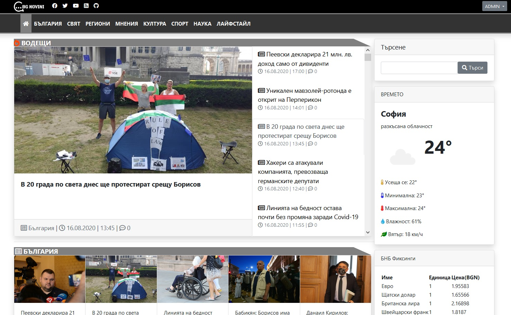
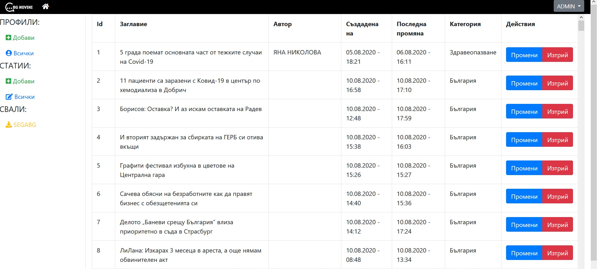

# NewsSite - BG Novini новинарски сайт
SoftUni Project - 04.2020

Features:
- Main page with categories.
- Searching by key words.
- Current weather in your town/city.
- Current BNB exchanges.
- Admin, Editor and Moderator roles. Admin can do everything, Editor can create and delete articles and Moderator can delete article comments.
- Simple dashboard for Administrators and Editors.
- Automatic(every 1h) scrapping of articles.
- Integrated HTML editor for article creation/editing.
- Integrated mailer.

Using:
- NET Core 3.1
- Entity Framework with MSSQL for DB.
- IpInfo.io API for checking IP physical location.
- OpenWeatherMap API for giving local town/city weather based on information from ipinfo.io API.
- Hangfire for background jobs(e.g. scrapping articles).
- TinyMCE for HTML editing.
- HTML Agility Pack for HTML scrapping.
- HTML Sanitizer for preventing malicious code.
- SendGrid for mailing.
- Newtonsoft.Json for JSON processing.
- Bootstrap for styling.

Main page

Admin dashboard

